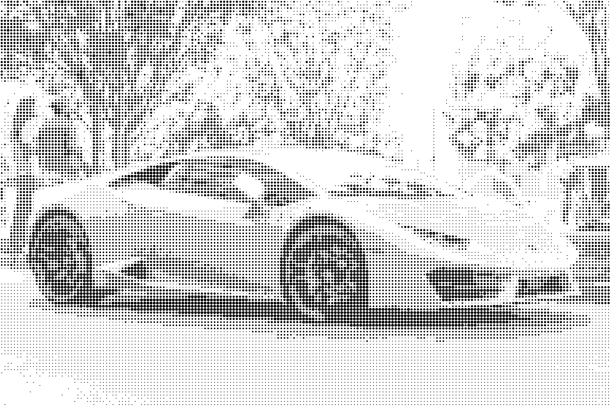
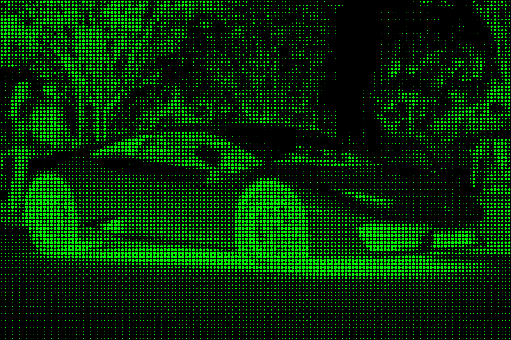
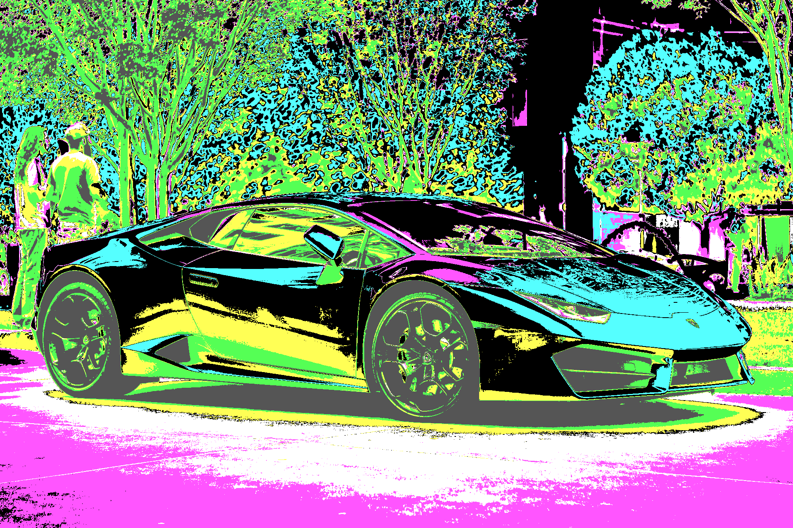
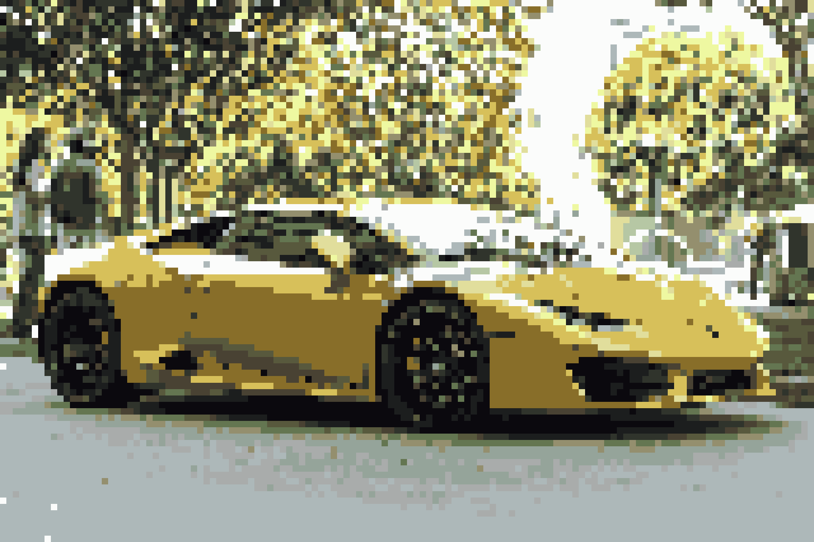
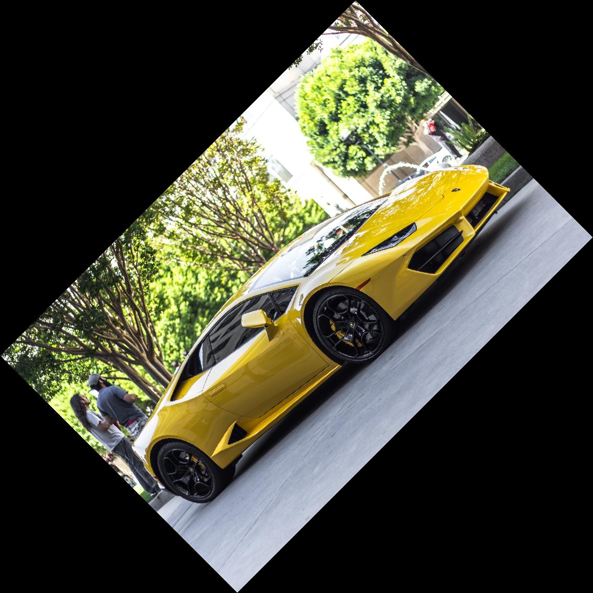
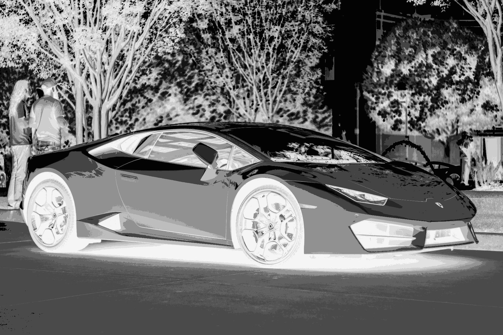
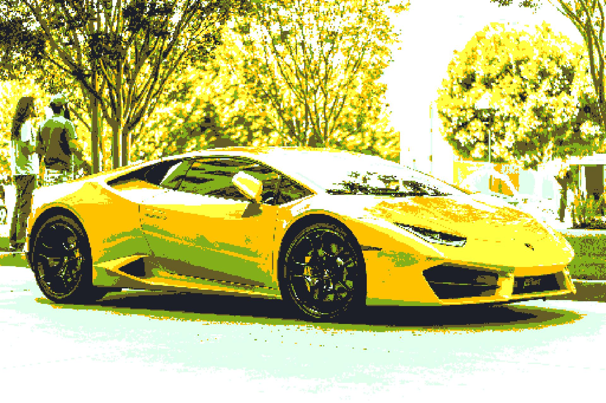
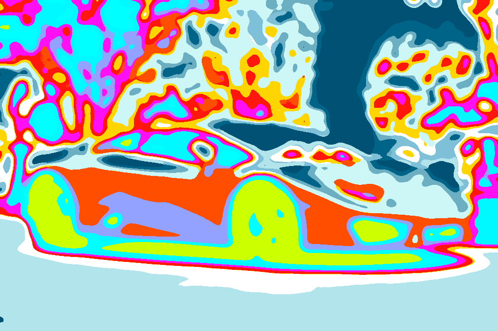

# PILFX - Batch Image Transformations and Effects with Python PIL

A Python batch image processing utility which uses the Pillow (PIL) library to apply various image effects and transformations.

## Requirements

- Python 3
- Pillow (PIL)
- Numpy

## Getting Started

1. Clone the repo 
```terminal
git clone https://github.com/bradsec/pilfx
```
2. Place original images into the `src` directory within the newly created pilfx directory. New images will be created in `dst` directory. These default locations can be changes using the -s and -d arguments.

3. Run the command `python3 pilfx.py (options)` as per examples shown below.

## Color Palettes
A list of pre-defined color palettes can be found in `color_palettes.py`. Additional palettes can be added you can then use by the name with `--set_colors "palettename"`

## Command-line Usage

```terminal

 ██████╗ ██╗██╗     ███████╗██╗  ██╗
 ██╔══██╗██║██║     ██╔════╝╚██╗██╔╝
 ██████╔╝██║██║     █████╗   ╚███╔╝ 
 ██╔═══╝ ██║██║     ██╔══╝   ██╔██╗ 
 ██║     ██║███████╗██║     ██╔╝ ██╗
 ╚═╝     ╚═╝╚══════╝╚═╝     ╚═╝  ╚═╝

 [Batch Image Transformations and Effects with Python PIL]

No command line arguments provided
usage: pilfx.py [-h] [-s SRC_DIR] [-d DST_DIR] [-c REDUCE_COLORS] [-g] [-i] [-o OPACITY] [-r ROTATE] [--width WIDTH] [--height HEIGHT]
                [--scale SCALE] [--algo ALGO] [--filetype FILETYPE] [--pixelize [PIXELIZE]] [--halftone [HALFTONE]] [--dither]
                [--posterize [POSTERIZE]] [--blur_before BLUR_BEFORE] [--blur_after BLUR_AFTER] [--brightness BRIGHTNESS]
                [--saturation SATURATION] [--htsample HTSAMPLE] [--set_colors SET_COLORS] [--set_trans_colors SET_TRANS_COLORS]

Process images.

optional arguments:
  -h, --help            show this help message and exit
  -s SRC_DIR, --src_dir SRC_DIR
                        Source (src) directory (contains original images to be processed)
  -d DST_DIR, --dst_dir DST_DIR
                        Destination (dst) directory (contains newly created images)
  -c REDUCE_COLORS, --reduce_colors REDUCE_COLORS
                        Reduce the amount of colors in the images color palette
  -g, --grayscale       Grayscale
  -i, --invert          Invert colors
  -o OPACITY, --opacity OPACITY
                        Set opacity of final image (values 0.0 to 1.0 with zero being fully transparent)
  -r ROTATE, --rotate ROTATE
                        Rotation angle
  --width WIDTH         New width
  --height HEIGHT       New height
  --scale SCALE         Scale percentage
  --algo ALGO           Change resample algorithm NEAREST = 0, LANCZOS = 1, BILINEAR = 2, BICUBIC = 3, BOX = 4, HAMMING = 5
  --filetype FILETYPE   Output filetype - .png (preserve transparency effects) or .jpg (no transparency, generally smaller file sizes)
  --pixelize [PIXELIZE]
                        Pixelize
  --halftone [HALFTONE]
                        Halftone foreground and background colors
  --dither              Apply FLOYDSTEINBERG dithering
  --posterize [POSTERIZE]
                        Posterize image bits 1-8
  --blur_before BLUR_BEFORE
                        Blur factor (before any effects applied) - Recommended values 0-10, high values can be used
  --blur_after BLUR_AFTER
                        Blur factor (after any effects are applied) - Recommended values 0-10, high values can be used
  --brightness BRIGHTNESS
                        Brightness
  --saturation SATURATION
                        Saturation
  --htsample HTSAMPLE   Change halftone sample size
  --set_colors SET_COLORS
                        Custom colors or color palette name to replace existing colors
  --set_trans_colors SET_TRANS_COLORS
                        Colors to be made transparent

```

## Sample Images and Commands

Sample photo credit - [Unsplash](https://unsplash.com/photos/X16zXcbxU4U)

| Command | Resulting Image |
|------------------|------------------|
| `python3 pilfx.py --halftone "#000000, #FFFFFF"`|  |
| `python3 pilfx.py --halftone "#00FF00, #000000" --htsample 20 --scale 150`|  |
| `python3 pilfx.py --set_colors "cga"`|  |
| `python3 pilfx.py --reduce_colors 16 --pixelize 128`|  |
| `python3 pilfx.py --scale 50 --rotate 45 --filetype .jpg` |  |
| `python3 pilfx.py --reduce_colors 16 --invert --grayscale --filetype .jpg` |  |
| `python3 pilfx.py --reduce_colors 8 --filetype .jpg --pixelize 512 --saturation 3.0 --brightness 1.5` |  |
| `python3 pilfx.py --set_colors "solarized" --width 1000 --blur_before 10 --saturation 2.0 --brightness 1.5` |  |

## Example Usage

```terminal
# Resize to a required width maintaining aspect ratio
python3 pilfx.py -width 1920

#  Resize to a required height maintaining aspect ratio
python3 pilfx.py -height 1080

# Note: Setting both width and height will not squash image it will crop to the size unless you have correct aspect ratio.

# Alternative resizing by scaling up or down (by percentage)

# Example for 200% (twice original size)
python3 pilfx.py --scale 200

# Example for 50% (half size)
python3 pilfx.py --scale 50

# Reduce colors in image

# Example reduce to 16 color image
python3 pilfx.py -c 16

# Example reduce to 4 color image
python3 pilfx.py -c 4

# Example reduce to two color image and change colors (use HEX values)
python3 pilfx.py -c 2 --set_colors "#000000,#FFFFFF"

# Example to reduce colors and set one of the colors to transparent
python3 pilfx.py -c 2 --set_colors "#000000,#FFFFFF" --set_trans_colors "#000000"

# Example using color palette defined in `color_palettes.py`
# This method will reduce the image colors by how many are in the named color_palette

python3 pilfx.py --set_colors "cga"
```

```terminal
# Creating a halftone effect (choose two HEX colors)
python3 pilfx.py --halftone "#FFFFFF,#000000"

# Change halftone sample size (circles) default is 10
# Increasing --htsample value will make the pattern larger
python3 pilfx.py --halftone "#FFFFFF,#000000" --htsample 20

# Halftone with transparent background
python3 pilfx.py --halftone "#FFFFFF, none"

# Halftone with original image in background
python3 pilfx.py --halftone "#000000, image"
```

```terminal
# Pixelize image retro effect try different values 64, 128, 256
python3 pilfx.py --pixelize 128

# Can be used with other combinations
python3 pilfx.py --set_colors "c64" --pixelize 128
```

```terminal
# Rotate images with --rotate and angle
python3 pilfx.py --rotate 90
```